當您擁有自己的網域時，通常會希望能夠使用該網域來創建專業的電子郵件地址。這不僅能提升您的品牌形象，還能讓您的通訊更加專業化。本文將詳細介紹如何將您的自訂網域與 Gmail 綁定，讓您能夠享受 Gmail 強大的功能，同時使用您自己的網域名稱作為電子郵件地址。

以下是將自訂網域綁定到 Gmail 的主要優點：

1. 專業形象：使用自己的網域名稱作為電子郵件地址可以增強您的專業形象和品牌認知度。

2. 靈活性：您可以創建多個電子郵件地址，如 info@yourdomain.com, support@yourdomain.com 等，全部都指向同一個 Gmail 帳戶。

3. 熟悉的介面：您可以繼續使用熟悉的 Gmail 介面和功能，同時擁有自訂網域的電子郵件地址。

4. 可靠性：Gmail 提供了優秀的垃圾郵件過濾和高可用性，確保您的電子郵件服務穩定可靠。

5. 成本效益：相比於設置和維護自己的郵件伺服器，使用 Gmail 與自訂網域結合是一個更經濟實惠的選擇。

在接下來的步驟中，我們將詳細說明如何通過 Cloudflare 設置 DNS 記錄，配置 Gmail 帳戶，以及如何驗證和使用您的新電子郵件地址。無論您是個人用戶還是小型企業，這個解決方案都能為您提供專業、可靠的電子郵件服務。

### 前置需求

- Cloudflare 有綁定網域
- 有 Gmail 帳號

## Cloudflare 設定

### 進入 Cloudflare 網域

- 選擇 `電子郵件路由` 選擇 `建立位址`
  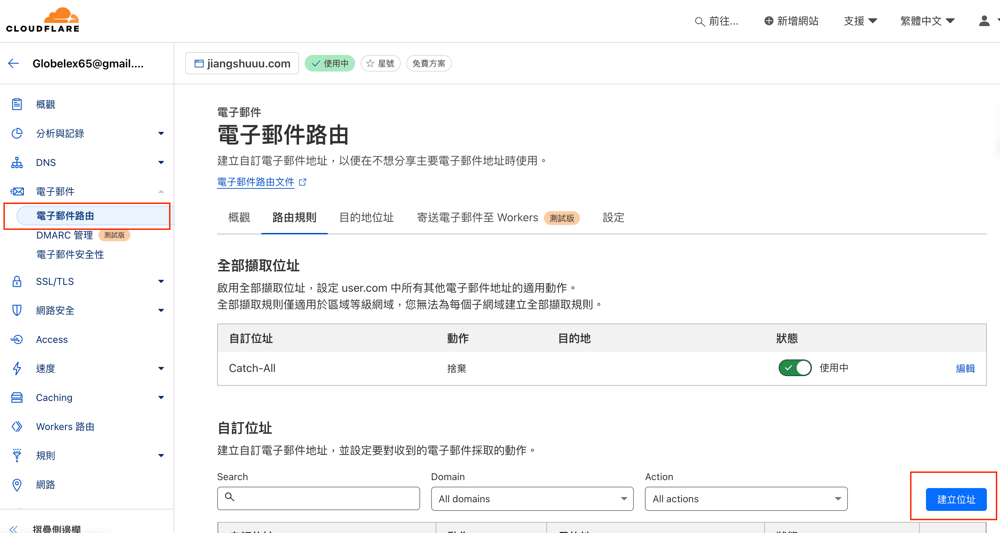

### 設定相關名稱

- 自訂位置為 `寄送名稱`
- 目的地為 `使用的 gmail 信箱`

  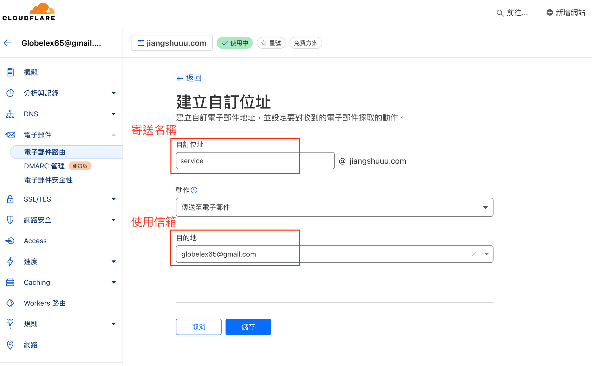

### 開啟 `Catch-All` 的狀態

- 儲存後回到原頁面, 會看到剛剛建立的信箱, 開啟 `Catch-All` 的狀態
  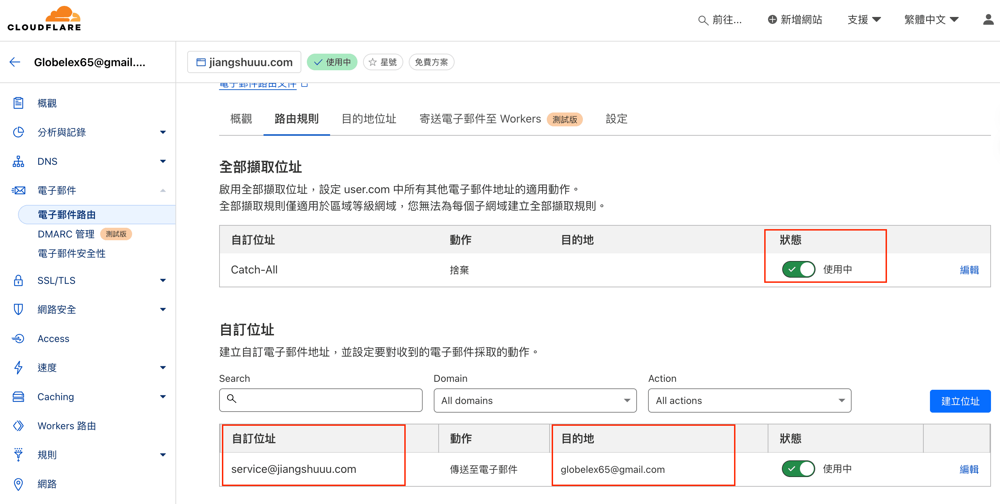

### `DNS` 設定

- 到 `DNS` 頁面, 找到以下內容, 按下編輯
  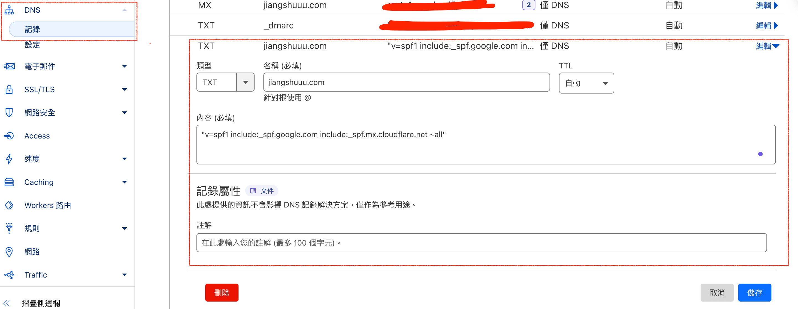
  :::note
  內容原本是 `v=spf1 include:_spf.mx.cloudflare.net ~all`
  請修改為 `v=spf1 include:_spf.google.com include:_spf.mx.cloudflare.net ~all`
  :::

## Google 權限設定

- 進入 google 帳號, 選擇 `安全性`, 選擇 `兩步驟驗證`
  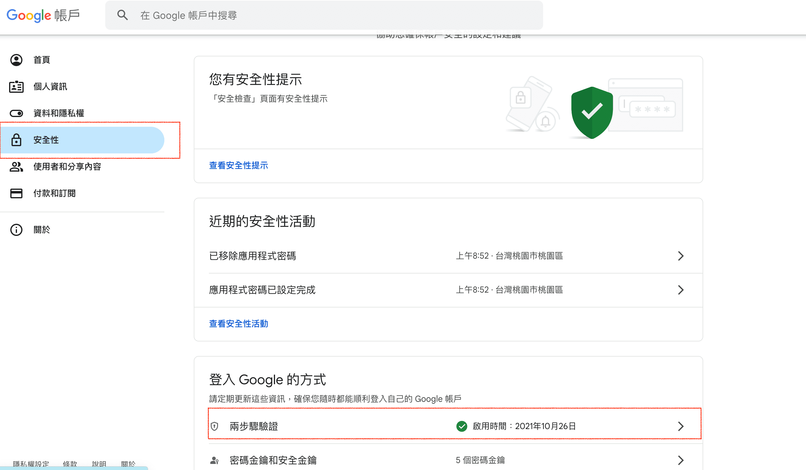

- 往下滾動, 找到 `應用程式密碼`
  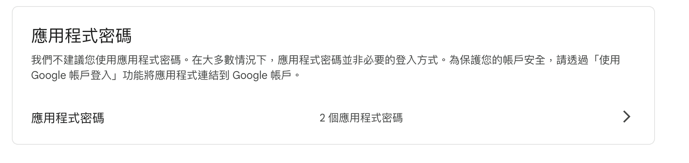

- 新增新的應用程式密碼, 記下密碼
  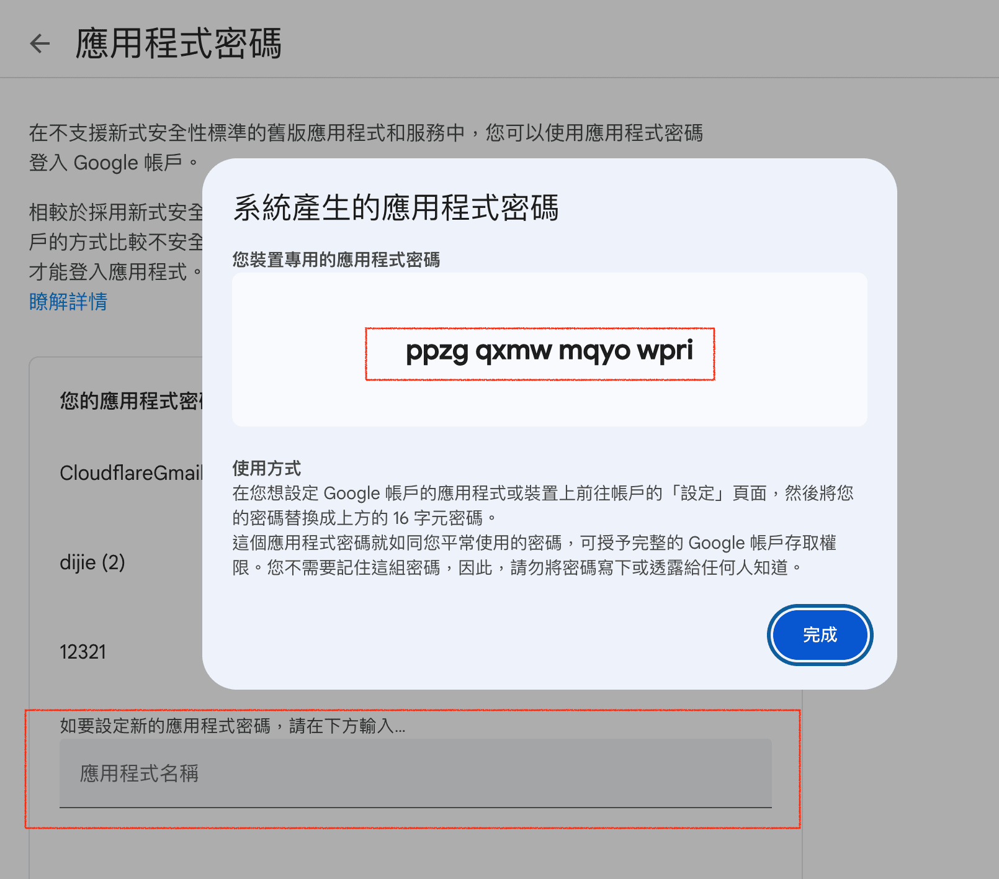

## Gmail 設定

- 進入 Gmail, 按下右上方齒輪, 選擇 `查看所有設定`
  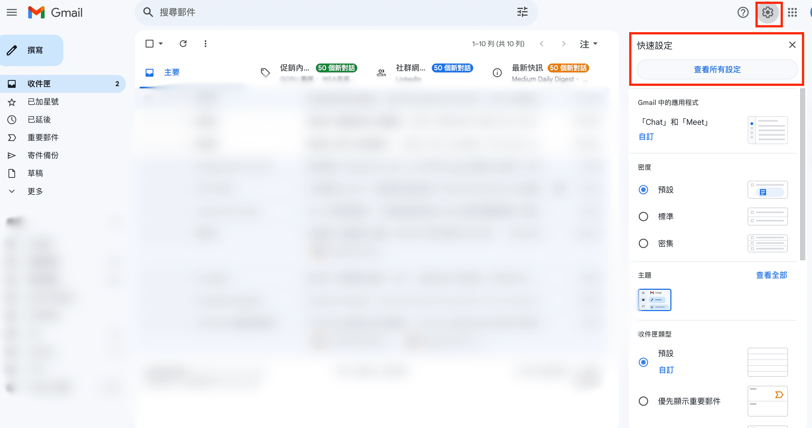

- 選擇 `帳戶與匯入`, 選擇 `新增另一個電子郵件地址`
  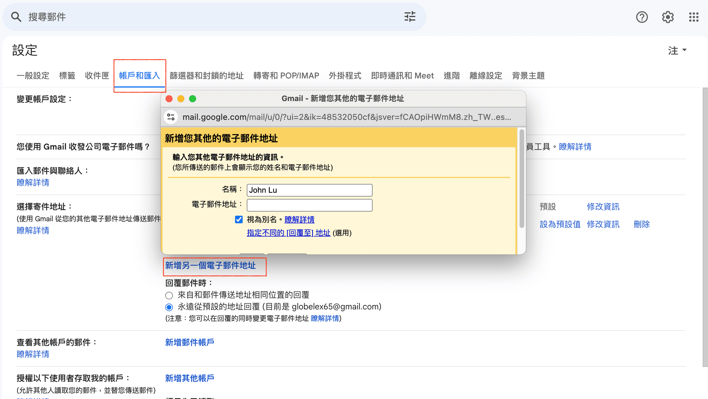

- 名稱為 `帳號取名, 依個人喜好`, 電子郵件為 `Cloudflare 設定的自訂位址信箱`, 確認後按下 `下一步`
  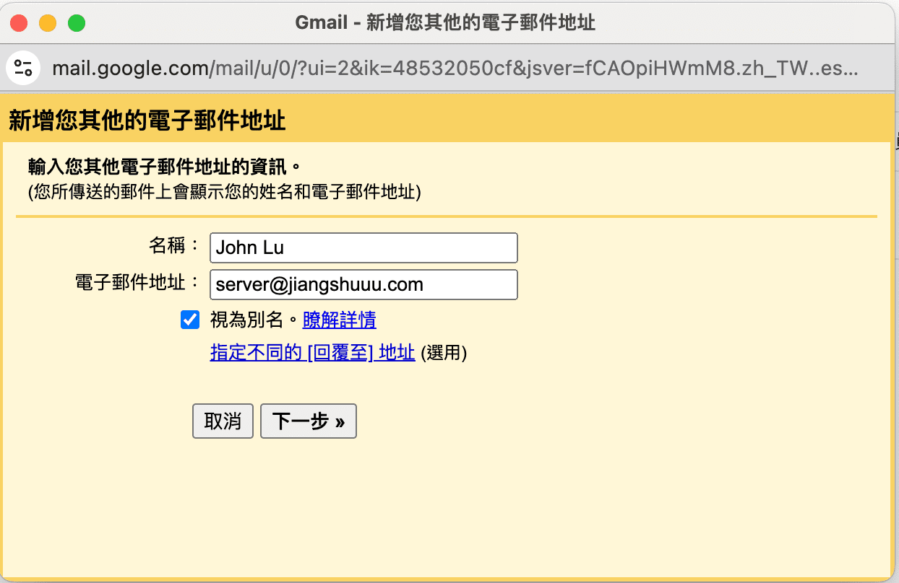

- SMTP 輸入 `smtp.gmail.com`, 連接埠 `587`, 使用者名稱 `你的 Gmail 帳號`, 密碼為 `剛剛新增的應用程式密碼`, 勾選 `使用 TLS`
  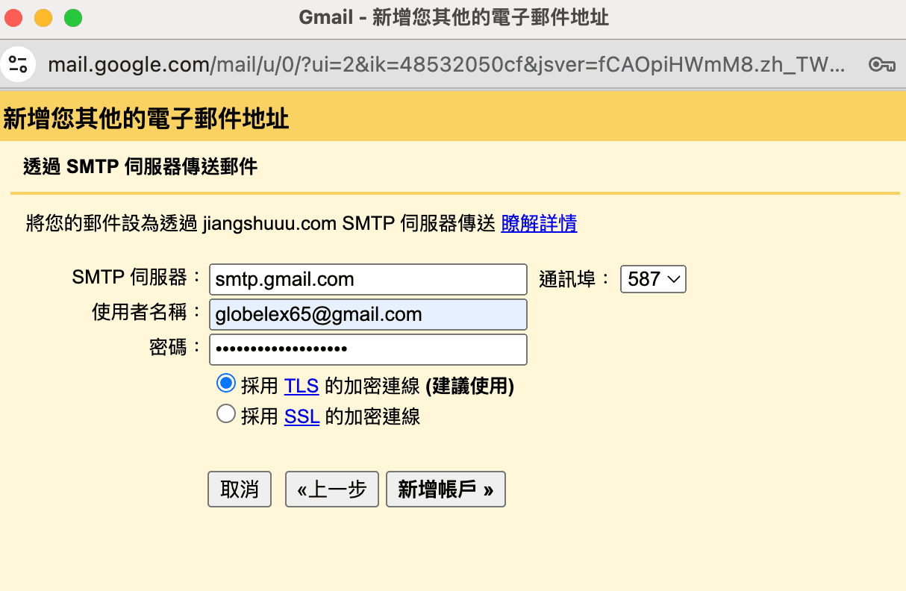

- 回到設定頁面, 確認出現剛剛設定的信箱, 並選擇預設, 即可進行寄信測試
  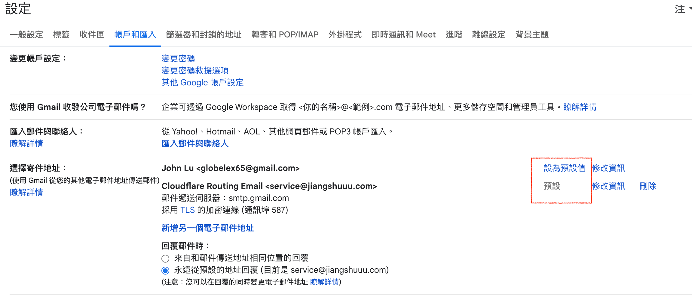

## Nodemailer 寄信測試

以下為 NodeJs 寄信測試的範例

### 安裝 nodemailer

```bash
npm install nodemailer express dotenv
```

### 建立 `example.html` 檔案

```html
<html>
  <head>
    <style>
      .container {
        font-family: Arial, sans-serif;
        margin: 0 auto;
        padding: 20px;
        max-width: 600px;
        background-color: #f9f9f9;
        border: 1px solid #ddd;
      }
      .header {
        background-color: #4caf50;
        color: white;
        text-align: center;
        padding: 10px 0;
      }
      .content {
        margin: 20px 0;
      }
      .footer {
        text-align: center;
        font-size: 12px;
        color: #777;
      }
    </style>
  </head>
  <body>
    <div class="container">
      <div class="header">
        <h1>Welcome!</h1>
      </div>
      <div class="content">
        <p>
          Thank you for joining our service. We are excited to have you on
          board!
        </p>
        <p>Here are some quick links to get you started:</p>
        <ul>
          <li>
            <a href="https://example.com/start">Getting Started Guide</a>
          </li>
          <li><a href="https://example.com/support">Customer Support</a></li>
        </ul>
      </div>
      <div class="footer">
        <p>&copy; 2024 Our Service. All rights reserved.</p>
      </div>
    </div>
  </body>
</html>
```

### 建立 `index.js` 檔案

```js
import express from "express";
import dotenv from "dotenv";
import nodemailer from "nodemailer";
import fs from "fs";
import path from "path";

dotenv.config();

const app = express();
const port = 3000;

app.get("/", (req, res) => {
  res.send("Hello World!");
});

const emailTemplatePath = path.resolve("example.html");
const emailTemplate = fs.readFileSync(emailTemplatePath, "utf8");

app.post("/email", async (req, res) => {
  const transporter = nodemailer.createTransport({
    service: "gmail",
    auth: {
      user: process.env.GMAIL_USER,
      pass: process.env.GMAIL_PASS,
    },
  });

  const mailOptions = {
    to: "globelex65@gmail.com",
    subject: "Welcome to Our Service!!!",
    html: emailTemplate,
  };

  await transporter.verify();

  transporter.sendMail(mailOptions, (err, info) => {
    if (err) {
      console.error(err);
      throw createError({
        statusCode: 500,
        message: "發送失敗",
      });
    } else {
      console.log(info);
      res.json({
        data: true,
      });
    }
  });
});

app.listen(port, () => {
  console.log(`Example app listening at http://localhost:${port}`);
});
```

## 測試

- gmail `帳號和匯入` 選擇寄送地址為 `Cloudflare 設定的自訂位址信箱`
  
- 執行 `node index.js`
- POST `http://localhost:3000/email`

- 進入信箱確認收信
  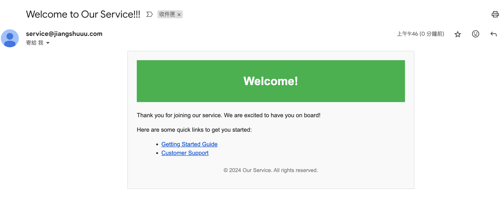
