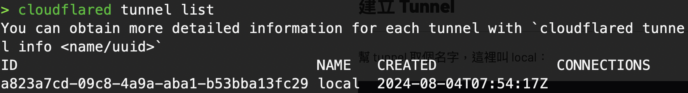
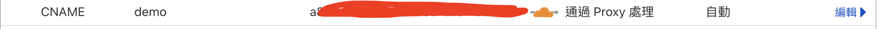
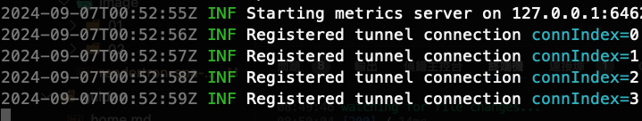

Cloudflare Tunnel 是一個由 Cloudflare 提供的工具，允許你將私有網路中的服務暴露到公共互聯網上。它類似於 Ngrok，但提供了更多的功能和更好的安全性，且是免費的。

## 優點

1. **安全性**：Cloudflare Tunnel 使用 TLS 加密所有流量，確保數據的安全性。
2. **易用性**：Cloudflare Tunnel 提供了簡單的命令行工具，可以快速部署和運行。
3. **可擴展性**：Cloudflare Tunnel 可以與 Cloudflare 的其他服務（如 DDoS 保護、WAF 等）集成，提供更全面的網絡安全解決方案。

## 安裝 Cloudflare Tunnel

- 需要在 Cloudflare 上有一個 Domain 來當路徑
- 需要有一個 Cloudflare 帳號

### 登入 Cloudflare

先開啟本地端的 terminal

```bash
cloudflared tunnel login
```

登入後系統會自動在 `~/.cloudflared/` 生成 `cert.pem` 作為後續與 cloudflare 溝通的憑證

### 建立 tunnel

以下以 `local` 為例，`local` 是 tunnel 的名稱

```bash
cloudflared tunnel create local
```

接著指令檢視本機所有的 tunnel, 確認 `local` 是否建立成功

```bash
cloudflared tunnel list
```



### 綁定域名

以我的網域為例 `jiangshuuu.com`，假設需要將 `demo.jiangshuuu.com` 綁定到 `local` 這個 tunnel 上

```bash
cloudflared tunnel route dns local demo.jiangshuuu.com
```

輸入完後，可以到 Cloudflare 的 DNS 區塊查看是否綁定成功



## 啟動 tunnel

現在假設需要將已啟動的 `http://localhost:3000` 暴露到 `demo.jiangshuuu.com`

```bash
cloudflared tunnel run --url http://localhost:3000 local
```

若 terminal 有顯示以下訊息，並且沒有紅字，代表 tunnel 啟動成功



最後就能從瀏覽器連上 `demo.jiangshuuu.com` 看到 `http://localhost:3000` 的畫面

## 關閉 tunnel

原本啟動 tunnel 的 terminal 按 `Ctrl + C` 就能關閉 tunnel

## 指令總覽

```js
// 登入 Cloudflare
cloudflared tunnel login

// 建立 tunnel
cloudflared tunnel create local

// 檢視本機所有的 tunnel
cloudflared tunnel list

// 綁定域名
cloudflared tunnel route dns local demo.jiangshuuu.com

// 啟動 tunnel
cloudflared tunnel run --url http://localhost:3000 local

// 關閉 tunnel
Ctrl + C
```
