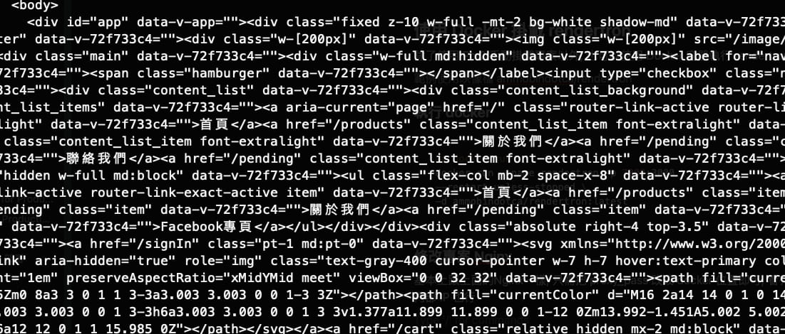
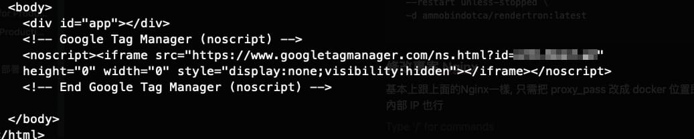

單頁應用程式（SPA）因其出色的用戶體驗而廣受歡迎，但卻面臨著搜尋引擎優化（SEO）的挑戰。由於 SPA 的內容主要由 JavaScript 動態生成，搜尋引擎爬蟲在抓取時往往只能看到一個空的 HTML 文件，導致首屏渲染內容無法被有效索引。雖然 Google 宣稱其搜尋引擎會等待虛擬 DOM 渲染完成後再抓取，但其他搜尋引擎的支援度仍有待觀察。(ex. Line, Facebook, twitter … 等)

為了改善 SPA 的 SEO，開發者通常會採用服務端渲染（SSR）的方式，將頁面在服務端渲染成完整的 HTML，再傳送給瀏覽器。然而，SSR 並非所有情況都適用，且可能增加伺服器負擔。

除了 SSR，Google Chrome 團隊開發的 [rendertron](https://github.com/GoogleChrome/rendertron) 提供了另一種解決方案。它可以在伺服器端執行 headless Chrome，將 SPA 渲染成靜態 HTML，以便搜尋引擎爬取。此外，預渲染（prerendering）也是一種常見的優化方式，可以將 SPA 的關鍵頁面預先渲染成靜態 HTML。

## 實作流程

1. clone 到雲端主機上
2. Pm2 執行它
3. 專案的 Nginx 設定, 讓 Nginx 判別如果是 bot 則導向 rendertron 爬網頁架構

## 使用 PM2 掛載 rendertron

### 進入雲端主機, 下載並安裝

```bash
## clone 專案
git clone https://github.com/GoogleChrome/rendertron.git

## 進入資料夾
cd rendertron

## 安裝
npm install

## build
npm run build

## start, 看terminal有沒有輸出內容 Listening on port 3000, 或者curl戳一下看有沒有rendertron架構
npm run start
```

### Pm2 掛載專案

確認可以執行後, 停掉程式改用 Pm2 來執行

```bash
## 安裝 pm2
npm install pm2 -g

## pm2 啟動render專案
pm2 start build/rendertron.js

## pm2 列表確認
pm2 list

## pm2 其他指令
pm2 stop [name]
pm2 restart [name]
pm2 delete [name]
```

### 修改專案 Nginx

- location 設定 prender
- 檢查如果是 bot 則導到 rendertron 去爬網站架構, 一般使用者則給一般 Html

[Nginx 設定參考連結](https://gist.github.com/thoop/8165802)

以下範例假設架好的 rendertron 網域為 www.rendertron.com

```bash
server {
    .... 省略 ....

    location / {
      try_files $uri @prerender;
    }

    location @prerender {
      set $prerender 0;

      if ($http_user_agent ~* "googlebot|bingbot|yandex|baiduspider|twitterbot|facebookexternalhit|rogerbot|linkedinbot|embedly|quora link preview|showyoubot|outbrain|pinterest\/0\.|pinterestbot|slackbot|vkShare|W3C_Validator|whatsapp") {
        set $prerender 1;
      }

      if ($args ~ "_escaped_fragment_") {
        set $prerender 1;
      }

      if ($uri ~* "\.(js|css|xml|less|png|jpg|jpeg|gif|pdf|doc|txt|ico|rss|zip|mp3|rar|exe|wmv|doc|avi|ppt|mpg|mpeg|tif|wav|mov|psd|ai|xls|mp4|m4a|swf|dat|dmg|iso|flv|m4v|torrent|ttf|woff|svg|eot)") {
        set $prerender 0;
      }

      #resolve using Google's DNS server to force DNS resolution and prevent caching of IPs
      resolver 8.8.8.8;

      if ($prerender = 1) {
        proxy_pass https://www.rendertron.com/render/$scheme://$host$request_uri;
      }

      if ($prerender = 0) {
        rewrite .* /index.html break;
      }
    }
  }
```

- $scheme 為 http / https
- $host 為 專案的網域/主機位置
- $request_uri 為 專案的網域/主機位置, “ / “後的內容(含” / “)

## 使用 Docker 掛載 rendertron

除了使用 Pm2 手動掛載專案以外, 也可以使用 Docker 開個 rendertron 容器

[範例使用映像檔 ammobindotca/rendertron](https://hub.docker.com/r/ammobindotca/rendertron/tags)

### 執行 docker

```bash
## docker run
docker run --name rendertron -p [對外port]:3000 \
--restart unless-stopped \
-d ammobindotca/rendertron:latest

## docker 檢查
docker ps
```

### 修改專案 Nginx

基本上跟上面的 Nginx 一樣, 只需把 proxy_pass 改成 docker 位置即可, 看有沒有使用網域, 或者改用內部 IP 也行

## 測試

```bash
## bot
curl -A "googlebot" https://profile.jiangshuuu.com/

## 一般使用者
curl https://profile.jiangshuuu.com/
```

- bot



- 一般使用者



- 題外話：rendertron 使用主機的好壞會影響架構回傳的速度, 也會影響 SEO 分數。
