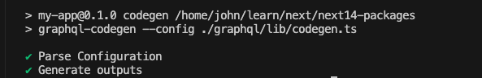
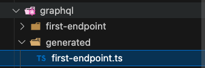

在 call graphQL 時, 通常的選擇會是 Apollo, 但自從 React Query 也開始支援後, call graphQL API 又多了一個新選擇

- React Query 為一個 fetch api 狀態管理套件, 可輕鬆做快取, retry 等功能
- GraphQL codegen 為一個自動產生型別的套件, 可以保持與後端型別一致

## Install

```jsx
npx create-next-app@latest

pnpm add graphql @tanstack/react-query

pnpm add -D @graphql-codegen/cli @graphql-codegen/typescript-operations @graphql-codegen/typescript-react-query @graphql-codegen/add
```

- package.json

```jsx
"scripts": {
  ...
  "codegen": "graphql-codegen --config codegen.ts"
}
```

## Setting

### codegen

- 此設定檔包含兩個路由
- 並且自訂 fetcher, 來應對需要身份驗證的情境

```jsx
// codegen.ts

require('dotenv').config({ path: '.env.local' });
import type { CodegenConfig } from '@graphql-codegen/cli';

const config: CodegenConfig = {
  overwrite: true,
  generates: {
    // first-endpoint
    // 此為產生型別及 useQuery 的檔案
    './graphql/generated/first-endpoint.ts': {
	    // 此為設定後端路由, 若有 token 限制則需要使用 token
      schema: {
        [process.env.NEXT_APP_PAYLOAD_API_URL as string]: {
          headers: {
            Authorization: `Bearer ${process.env.NEXT_APP_PAYLOAD_API_TOKEN}`,
          },
        },
      },
      // react-query plugins
      plugins: [
        'typescript',
        'typescript-operations',
        'typescript-react-query',
      ],
      // 設定 query 的 files path
      documents: './graphql/first-endpoint/*.graphql',
      config: {
	      // react-query v5 需要設定
        reactQueryVersion: 5,
        exposeQueryKeys: true,
        exposeFetcher: true,
        withHooks: true,
        dedupeFragments: true,
        // 自訂 fetcher 路徑
        fetcher: '@/graphql/lib/first-fetcher#fetcher',
      },
    },
    // second-endpoint
    './graphql/generated/second-endpoint.ts': {
      schema: process.env.NEXT_APP_PAYLOAD_API_URL_2,
      plugins: [
        'typescript',
        'typescript-operations',
        'typescript-react-query',
      ],
      documents: './graphql/second-endpoint/*.graphql',
      config: {
        reactQueryVersion: 5,
        exposeQueryKeys: true,
        exposeFetcher: true,
        withHooks: true,
        dedupeFragments: true,
        fetcher: '@/graphql/lib/second-fetcher#fetcher',
      },
    },
  },
};

export default config;
```

### Providers

```jsx
// providers.tsx

"use client";

// Since QueryClientProvider relies on useContext under the hood, we have to put 'use client' on top
import { ReactNode } from "react";
import {
  isServer,
  QueryClient,
  QueryClientProvider,
} from "@tanstack/react-query";

function makeQueryClient() {
  return new QueryClient({
    defaultOptions: {
      queries: {
        // With SSR, we usually want to set some default staleTime
        // above 0 to avoid refetching immediately on the client
        staleTime: 60 * 1000,
      },
    },
  });
}

let browserQueryClient: QueryClient | undefined = undefined;

function getQueryClient() {
  if (isServer) {
    // Server: always make a new query client
    return makeQueryClient();
  } else {
    // Browser: make a new query client if we don't already have one
    // This is very important, so we don't re-make a new client if React
    // suspends during the initial render. This may not be needed if we
    // have a suspense boundary BELOW the creation of the query client
    if (!browserQueryClient) browserQueryClient = makeQueryClient();
    return browserQueryClient;
  }
}

export default function Providers({ children }: { children: ReactNode }) {
  // NOTE: Avoid useState when initializing the query client if you don't
  //       have a suspense boundary between this and the code that may
  //       suspend because React will throw away the client on the initial
  //       render if it suspends and there is no boundary
  const queryClient = getQueryClient();

  return (
    <QueryClientProvider client={queryClient}>{children}</QueryClientProvider>
  );
}
```

- 設定 Providers

```jsx
import Providers from "@/path/to/providers";

export default function RootLayout({
  children,
}: {
  children: React.ReactNode,
}) {
  return (
    <html lang="en">
      <body className={inter.className}>
        // add here
        <Providers>
          <div>{children}</div>
        </Providers>
      </body>
    </html>
  );
}
```

### fetcher

- 此檔案自訂 Authorization Headers, 並透過 options 傳值來動態調整

```jsx
// first-fetcher.ts

import { isServer } from "@tanstack/react-query";

type FetchOptions = {
  cache?: RequestCache,
  next?: NextFetchRequestConfig,
  verifyToken?: string,
};

type RequestInit = {
  headers: (HeadersInit & FetchOptions) | FetchOptions,
};

export const fetcher = <TData, TVariables>(
  query: string,
  variables?: TVariables,
  options?: RequestInit["headers"]
) => {
  return async (): Promise<TData> => {
    console.log("first-fetcher", options);
    let accessToken = "";

    if (isServer) {
      // server side token
      accessToken = "";
    } else {
      // client side token
      accessToken = "";
    }

    // options override token
    if (options?.verifyToken) {
      accessToken = options.verifyToken;
    }

    const { next, cache, ...restOptions } = options || {};
    const res = await fetch(`${process.env.NEXT_PUBLIC_PAYLOAD_API_URL}`, {
      method: "POST",
      headers: {
        "Content-Type": "application/json",
        ...(accessToken ? { Authorization: `Bearer ${accessToken}` } : {}),
        ...restOptions,
      },
      body: JSON.stringify({ query, variables }),
      next,
      cache,
    });

    const json = await res.json();

    if (json.errors) {
      const { message } = json.errors[0];

      throw new Error(message);
    }

    return json.data;
  };
};
```

## 產生方法

### First Step: Create Graphql

- 找到需要使用的 Query, 並且在 codegen 設定的路徑位置建立檔案,
  以上方為例, first-endpoint 為 documents: './graphql/first-endpoint/\*.graphql',

```jsx
// ./graphql/first-endpoint/example.graphql

query Example($id: bigint!) {
  station_by_pk(id: $id) {
    name
    address
    open
    close
    latitude
    longitude
    fleet {
      id
      telephone
      organization {
        name
      }
      rental_company {
        organization {
          id
          name
        }
        rental_company_policies {
          rental_policy {
            id
            description
          }
        }
      }
    }
  }
}
```

### Second Step: 指令產生型別及方法

- pnpm codegen

接著會看到類似的指令顯示則為成功



可以至 codegen 設定位置確認檔案產生



### Third Step: 組件使用

以上方為例 query 命名為 FirstExample, 則 /graphql/first-endpoint/first-endpoint.ts 會自動產生 method 名為 useFirstExampleQuery, 若為 Mutation 則為 useFitstExampleMutaion

## Client Component

### Query

```jsx
"use client";

import { useFirstExampleQuery } from "@/graphql/generated/first-endpoint";
import { ChildButton } from "./components/childButton";

export default function ClientComponent() {
  const { data, isFetching, error, refetch } = useFirstExampleQuery({
    id: 1,
  });

  if (isFetching) return <div>Loading...</div>;
  if (error) return <div>Error: {JSON.stringify(error, null, 2)}</div>;

  return (
    <div className="p-4">
      <div className="flex gap-2 pb-2">
        <ChildButton />
        <button
          className="rounded border border-black p-2"
          onClick={() => refetch()}
        >
          Refetch
        </button>
      </div>
      <p className="text-2xl font-bold">Client Component</p>
      <pre>{JSON.stringify(data, null, 2)}</pre>
    </div>
  );
}
```

### Mutation

```jsx
"use client";

import { useMutation } from "@tanstack/react-query";
import { useCustomerLoginMutation } from "@/graphql/generated/second-endpoint";

export default function ClientMutation() {
  const { mutate, isPending, error } = useMutation({
    mutationFn: ({
      phoneNumber,
      password,
    }: {
      phoneNumber: string;
      password: string;
    }) => {
      return useCustomerLoginMutation.fetcher(
        {
          phoneNumber,
          password,
        },
        {
          test: "123",
        }
      )();
    },
  });

  const handleSubmit = () => {
    mutate({
      phoneNumber: "0912345678",
      password: "Q12345678",
    });
  };

  return (
    <div className="space-y-4 p-4">
      <p className="text-2xl font-bold">Client Mutation</p>
      <button
        className="rounded border border-black p-2"
        onClick={handleSubmit}
      >
        送出
      </button>
      {isPending && <div>Loading...</div>}
      {error && <div>錯誤: {(error as Error).message}</div>}
    </div>
  );
}

```

### fetcher - query

- 當要在 call api 前傳值判斷的話, 則可以使用剛剛設定的 fetcher

```jsx
"use client";

import { useFirstExampleQuery } from "@/graphql/generated/first-endpoint";
import { ChildButton } from "../components/childButton";
import { useQuery } from "@tanstack/react-query";

export default function ClientComponent() {
  const { data, isFetching, error, refetch } = useQuery({
    queryKey: useFirstExampleQuery.getKey({ id: 1 }),
    queryFn: useFirstExampleQuery.fetcher(
      { id: 1 },
      {
        test: "123421421",
      }
    ),
  });

  if (isFetching) return <div>Loading...</div>;
  if (error) return <div>Error: {JSON.stringify(error, null, 2)}</div>;

  return (
    <div className="p-4">
      <div className="flex gap-2 pb-2">
        <ChildButton />
        <button
          className="rounded border border-black p-2"
          onClick={() => refetch}
        >
          Refetch
        </button>
      </div>
      <p className="text-2xl font-bold">Client Component</p>
      <pre>{JSON.stringify(data, null, 2)}</pre>
    </div>
  );
}
```

當 call api 時, {test: “123421421”} 會當作 options 傳進 fetcher

### fetcher - mutation

- 比起 query, mutation 使用到的場景更多

```jsx
// example

const { mutate, isPending } = useMutation({
  mutationFn: ({
    code,
    accessToken,
  }: {
    code: string,
    accessToken: string,
  }) => {
    return useVerifyCodeForMailVerificationMutation.fetcher(
      {
        code,
      },
      {
        verifyToken: accessToken,
      }
    )();
  },
});
```

## Server Component

### Query

server component 沒有 useQuery 使用, 需引入 QueryClient, 再掛上我們剛產好的 useQuery 來 call api

而型別也一起產好了, 可以接在 fetchQuery 上

最後需在組件最外層使用 HydrationBoundary 、 dehydrate 來傳入 query data

```jsx
import {
  dehydrate,
  HydrationBoundary,
  QueryClient,
} from "@tanstack/react-query";

import {
  useFirstExampleQuery,
  FirstExampleQuery,
} from "@/graphql/generated/first-endpoint";

export default async function ServerComponent() {
  const queryClient = new QueryClient();

  const data =
    (await queryClient.fetchQuery) <
    FirstExampleQuery >
    {
      queryKey: useFirstExampleQuery.getKey({ id: 1 }),
      queryFn: useFirstExampleQuery.fetcher({
        id: 1,
      }),
    };

  return (
    <HydrationBoundary state={dehydrate(queryClient)}>
      <div className="p-4">
        <p className="text-2xl font-bold">Server Component</p>
        <pre>{JSON.stringify(data, null, 2)}</pre>
      </div>
    </HydrationBoundary>
  );
}
```

### Mutation

```jsx
import { QueryClient } from "@tanstack/react-query";
import {
  useCustomerLoginMutation,
  CustomerLoginMutation,
} from "@/graphql/generated/second-endpoint";

export default async function ServerComponent() {
  const queryClient = new QueryClient();
  const data =
    (await queryClient.fetchQuery) <
    CustomerLoginMutation >
    {
      queryKey: ["login"],
      queryFn: useCustomerLoginMutation.fetcher({
        phoneNumber: "0912345678",
        password: "Q12345678",
      }),
    };

  return (
    <div className="space-y-4 p-4">
      <p className="text-2xl font-bold">Server Mutation</p>
      <pre>{JSON.stringify(data, null, 2)}</pre>
    </div>
  );
}
```

### fetcher - query

```jsx
import {
  dehydrate,
  HydrationBoundary,
  QueryClient,
} from "@tanstack/react-query";

import {
  useFirstExampleQuery,
  FirstExampleQuery,
} from "@/graphql/generated/first-endpoint";

export default async function ServerComponent() {
  const queryClient = new QueryClient();

  const fetchAllPosts = useFirstExampleQuery.fetcher(
    {
      id: 1,
    },
    {
      test: "123",
    }
  );

  const data =
    (await queryClient.fetchQuery) <
    FirstExampleQuery >
    {
      queryKey: useFirstExampleQuery.getKey({ id: 1 }),
      queryFn: fetchAllPosts,
    };

  return (
    <HydrationBoundary state={dehydrate(queryClient)}>
      <div className="p-4">
        <p className="text-2xl font-bold">Server Component</p>
        <pre>{JSON.stringify(data, null, 2)}</pre>
      </div>
    </HydrationBoundary>
  );
}
```

### fetcher - mutation

```jsx
import { QueryClient } from "@tanstack/react-query";
import {
  useCustomerLoginMutation,
  CustomerLoginMutation,
} from "@/graphql/generated/second-endpoint";

export default async function ServerComponent() {
  const queryClient = new QueryClient();
  const data =
    (await queryClient.fetchQuery) <
    CustomerLoginMutation >
    {
      queryKey: ["login"],
      queryFn: useCustomerLoginMutation.fetcher(
        {
          phoneNumber: "0912345678",
          password: "Q12345678",
        },
        // add here
        {
          test: "123",
        }
      ),
    };

  return (
    <div className="space-y-4 p-4">
      <p className="text-2xl font-bold">Server Mutation</p>
      <pre>{JSON.stringify(data, null, 2)}</pre>
    </div>
  );
}
```

## Reference

<a href="https://tanstack.com/query/latest/docs/framework/react/guides/advanced-ssr#server-components--nextjs-app-router" target="_blank">TanStack Query - SSR & Next.js App Router</a>

<a href="https://the-guild.dev/graphql/codegen/plugins/typescript/typescript-react-query#using-custom-fetcher" target="_blank">GraphQL Code Generator - using custom Fetcher</a>

<a href="https://plainenglish.io/community/next-js-app-router-graphql-codegen-and-tanstack-query" target="_blank"> Kevin Schaffter Example</a>
